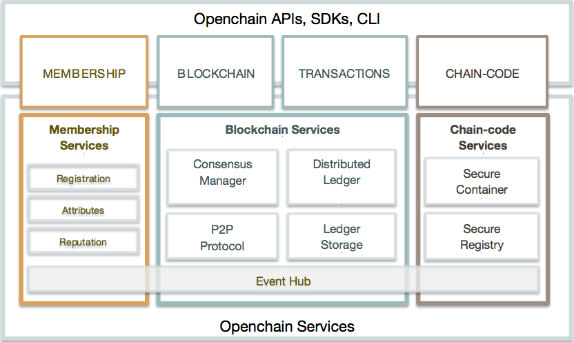
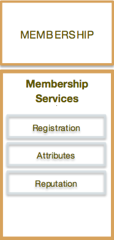

# Openchain Technical Specification

_This document is subject to change as development progresses_

## Introduction
Enterprises today need to reduce frictions around their operations, both internal and external facing operations, to reduce their costs and lower the response times of their services to customers, employees, and suppliers.

Typically, applications that provide these services must apply Service Oriented Architecture (SOA) to communicate with each other via Application Programming Interface (API), which captures the business rules that the entity publishes for external usage. This technique has facilitated the evolution of API Economy in the last decade, where businesses monetize capabilities through APIs.

Blockchain promises to transform the integration model of many types of business applications, from banking and securities to supply-chain. The key ingredient is the shared ledger containing the necessary data locally for the applications to operate without having to call an external API, which would introduce additional complexity (access control, data transit security, trust). This is the basis of decentralization – all parties participate in the network of computer nodes to maintain the ledger such that they have exactly the same state with properties such as tamper-proof, and resilience to attacks.

Based on this principle, Openchain will be built from ground up to enhance the blockchain protocol with enterprise features for private ledgers, where participants are registered and known to the network. The new protocol (Openchain protocol) must address the following key challenges:

*  **Privacy**: Ability to protect the users from intrusions into personal matters (rights to privacy). The system must provide mechanisms to conceal identity from being publically identified by those who are not stakeholders or not authorized.
*  **Confidentiality**: Ability to protect the data from unauthorized access. This is an ethical duty that the system must provide to maintain the confidential of the transactions such that third party or outsiders cannot view the content.
*  **Auditability**: Ability to view and certify the truth of the transactions and data pertaining to a party. The system must provide sufficient knowledge about the transactions and their structures so that the auditors can determine the accuracy and reliability of accounting statement and reports [1].

Besides above challenges, as a private network, security becomes a mater of the utmost importance: Nodes must be known; access must be controlled; and identity must be verified. This will enable the network to recognize and eliminate bad and malicious entities that might try to disrupt the functioning of the network.

Beginning with a private network where nodes are known members, Openchain defines validators (via configuration) as nodes on the network responsible for maintaining the ledger; that means the validators, and only the validators, verify and process transactions then commit transactions to the ledger based on the result of the consensus. The rest of other nodes are none-validators; they receive the replicated ledger, but they don’t write to the ledger. The none-validators serve a very essential role in the network: Taking the workload off the validators in servicing the client requests.

Openchain architecture allows a pluggable consensus algorithm per deployment. That is each network may have a different consensus algorithm suitable for the requirements and usage scenarios of that network. Openchain protocol will provide a Practical Byzantine Fault Tolerance (PBFT) [4] implementation. The community or private development may supply other consensus algorithms.

Openchain protocol starts with an identity, which is a cryptographic certificate encapsulating the user’s registered confidential data managed by a Registration Authority, who can issue and revoke identities participating on the network. From this identity, the protocol will generate butterfly keys [3] for members to transact on the network. The butterfly keys conceal the identities of the transacting parties, providing the solution to the privacy requirement.

Content confidentiality is achieved by encrypting the transactions such that only the counter-parties can decrypt and execute the transactions. The encryption also includes the transaction code in its final form being deployed to blockchain. So both code and transaction content, where confidentiality is required, will be cryptographically secured at rest. The code will only be loaded and decrypted at runtime.

There are 2 types of transactions on an Openchain network: Deploying-code and invoking-code. Code running transactions is called chaincode, a decentralized transactional program, run by validators. A deploying-code transaction consists of submitting, updating, or terminating a chaincode. The validators will manage the authenticity and integrity of the code and execution. An invoking-code transaction is a call to a chaincode function (similar to a URI invoking a servlet in JEE), which may change the state of the ledger.

The concept of chaincode is more general than that of smart contract as defined by Nick Szabo [4], to emphasize the goal of bringing what he calls the "highly evolved" practices of contract law and related business practices to the design of electronic commerce protocols between strangers on the Internet. Chaincode supports any mainstream programming languages, Turing complete. Execution environment is docker container with Openchain context layer. So chaincode provides capabilities to define smart contract templating language (similar to Velocity or Jade), which will restrict the functionality of the execution environment and the degree of flexibility in computing to satisfy the legal contractual requirements. Using template language, the skills required to code a smart contract may be lowered, enabling domain knowledge professionals to write smart contracts.

Running a transaction on chaincode is always time bounded, which is configured during chaincode deployment. This is similar to a database call or a Web service invocation. If a transaction times out, it is considered an error and will not effect the state of the ledger. A chaincode may call another chaincode if the callee has the same or less restrictive confidentiality scope; that is, a confidential chaincode may call a public chaincode or another confidential chaincode with the same assigned validators.

For confidential chaincode, when deploy, appropriate validators must be assigned since only these assigned validators can run the transactions on this chaincode. This creates quorums of validators during execution of transaction blocks. Validators can just request for the state of those transactions that they are not assigned and skip over. At the end of the successful block execution and consensus completed, the world state must be the same on all validators, whether a validator took part in executing any transaction or not.

There are REST and JSON RPC APIs, events, and an SDK for applications to communicate with Openchain. Typically applications interact with a peer node, which will require some form of authentication to ensure the entity has proper privilege to interact with the network. Messages from a client are signed by the client identity, and verified by the peer node.

Even though Openchain doesn’t provide a native crypto-currency like Bitcoin or Ethereum, it can be easily implemented with a chaincode. Similarly for any on-chain assets, they can be encoded with chaincodes.

## Architecture
Figure 1 below shows the reference architecture aligned in 3 categories: Membership, Blockchain, and Chaincode. These catagories are logical structure, not a physical depiction of partitioning of components into separate processes, address spaces or (virtual) machines.

Some of these components will be built from ground up; some will use existing open source code as appropriate, and some will just interface with existing services to fulfill the required functions.

Figure 1:  Openchain Reference architecture

Membership category provides services for managing identity, privacy, and confidentialy on the network. Participants register to get identities, which will enable the Attribute Authority to issue butterfly keys to transact. Repulation Manager enables auditors to see transacations pertaining to a participant. Of course, auditors will have to be granted proper access authority by the participants.

Blockchain services manage the distributed ledger through a peer-to-peer protocol, built on HTTP/2. The data structures are highly optimized to provide the most efficient hash algorithm for maintaining the world state replication. Different consensus (PBFT, Raft, PoW, PoS) may be plugged in and configured per deployment.

Chaincode services provide a secured and lightweight to sandbox the chaincode execution on the validators. The environment is a “locked down” and secured container along with a set of of signed base images containing secure OS and chaincode language, runtime and SDK images for Golang, Java, and Node.js. Other languages can be enabled if required.

### MEMBERSHIP

<table>
<col width="30%">
<col >
<tr>
<td></td>
<td valign="top">
Openchain is a private network, so all entities are required to register with membership services to get identity to access and to transact on the network. 

Registration Authority issues enrollment certificate necessary to establish identity for a member. Once registered, the member has the required credentials to participate in the network, no needs for proof or work or proof of stake at this point. 

Attributes Authority issues butterfly keys to members to transact and to ensure the privacy of the members on the network. None-stakeholders can't link the transactions back to the members. Transactions appear to be coming from random addresses, completely shuffled by the system. 

Reputation Manager allows authorized auditors to link butterfly keys to identity, and consequently, prove the relationship between transactions and members.
</td>
</tr>
</table>

### BLOCKCHAIN

<table>
<col width="40%">
<col >
<tr>
<td></td>
<td valign="top">
Blockchain services consists of 3 key components: Distributed Ledger, Consensus Manager, and Peer-to-Peer (P2P) Protocol. 

P2P Protocol uses <a href="http://www.grpc.io/docs">Google RPC</a>, which is implemented over HTTP/2 standards, providing many capabilities including bidirectional streaming, flow control, multiplexing requests over a single connection. And most important of all, it works with existing Internet infrastructure – firewalls, proxies, and security. This component defines messages used by peer nodes, from point-to-point to multicast. 

The Distributed  Ledger component manages the blockchain and the world state with 3 key attributes:
<ul>
  <li>Efficiently calculating a cryptographic hash of the entire dataset after each block</li>
  <li>Efficiently transmitting a minimal "delta" of changes to the dataset, when a peer is out of sync and needs to "catch up”</li>
  <li>Minimizing the amount of data kept around necessary for each peer to operate</li>
</ul>
</td>
</tr>
</table>

The Ledger uses <a href="http://rocksdb.org"> RocksDB</a> to persist the dataset and builds an internal datas tructure to represent the state that satisfies the above 3 criteria. Large documents or files are not stored on the Ledger but off-chain storage. Their hashes may be stored on-chain as part of the transactions. This is necessary to maintain the integrity of the documents or files.

The world state represents the state for all chaincodes. Each chaincode is assigned its own state that can be used to store data in a key-value format where keys and values are arbitrary byte arrays. The state also contains the number of the block to which it corresponds.

As transactions are run in a new block, the delta from the state in the last block on the blockchain is maintained. If consensus is reached for the current block, the state changes are committed to the database, and the state block number is incremented by 1. If peers do not reach consensus, the delta is discarded and the database is not modified.

Consensus Manager is an abstraction defining the interface between the consensus algorithm and the other components. Consensus receives transactions, and depending on the algorithm, decides how to organize the transactions and when to execute the transactions. Successful execution of transactions results in changes to the ledger.

Openchain provides an implementation of Byzantine Agreement with advanced features in fault tolerance and scalability.

Event Hub in a decentralized network is complex in nature, as an event may appear to occur multiple times, each on a peer node. Callbacks would end up receiving multiple invocations for the same event. Therefore, a peer node (preferably none-validator and local) manages the event pub/sub that applications are interacting with. The peer node emits events as conditions satisfied in no particular order. Events are not persisted but more of fire-and-forget, so applications should capture events if required.

### CHAINCODE
<table>
<col width="30%">
<col >
<tr>
<td></td>
<td valign="top">
As defined in the Introduction section, chaincode is a decentralized transactional program, running on the validators, 

Chaincode Services use <a href="https://github.com/docker/"> Docker </a> to host the chaincode without relying on any particular virtual machine or computer language. Docker provides a secured lightweight to sandbox the chaincode execution. The environment is a “locked down” and secured container along with a set of of signed base images containing secure OS and chaincode language, runtime and SDK images for Golang, Java, and Node.js. Other languages can be enabled if required. 

Secure Registry service enables Secured Docker Registry of base Openchain images and custom images containing chaincodes

</td>
</tr>
</table>

## Application Programming Interface
 

At the top, CLI is the command line interface to the network. Openchain provides a set of CLI to administer and manage the network. CLI can also be used during development to test chaincodes. ReST API and SDK are built on top of JSON-RPC API, which is the most complete API layer. SDK will be available in Golang, JavaScript, and Java. Other languages can be added as necessary.

The API spans following categories:
*  Identity - Enrollment to get certificates or revoking a certificate
*  Address - Target and source of a transaction
*  Transaction - Unit of execution on the ledger
*  Chaincode - Program running on the ledger
*  Blockchain - Content of the ledger
*  Network - Information about the blockchain network
*  Storage - External store for files or documents
*  Event - Sub/pub events on blockchain

### Identity
*  Register: Register a user or endpoint for identity
*  Revoke an Identity: The identity will no long be valid in the network
*  Get Identity from Address: Return the identity owning the address

### Address
*  Get Addresses: Return addresses belongs to an identity
*  Create Address: Create and return a butterfly address for an identity

### Transaction
*  Get Transactions by Address: Return transactions of an address
*  Get Transaction by Hash: Return transaction identified by the hash
*  Get Transactions by Identity: Return transactions belong to identity

### Chaincode
*  Deploy (optional multisig): Deploy a chaincode to the ledger. In the multisig case, the chaincode is only active when all the signatures are present; otherwise, calling the chaincode will result in errors.
*  Undeploy: Mark the chaincode as invalid; call any function return error
*  List: Return all visible chaincodes
*  Run a Function: Call a chaincode function as a transaction
*  Test a Function: Call a chaincode function without a transaction. Any changes to the state will not be persisted
*  Set stakeholders: List of members or groups who can run the chaincode. Default is everyone
*  Get stakeholders: Return the list of stakeholders

### Blockchain
*  Get Blockchain: Return info about the ledger such as height, current block hash, etc
*  Get Block by Number: Return info about a block (JSON data structure)
*  Get Block Count

### Network
*  Get Network: Return number of nodes, ports, version, timestamp
*  Shutdown: Begin the network shutdown procedure

### Storage
*  Store Document: Store and return the hash of the document
*  Store Documents: Store an array of documents and return the array of hashes
*  Get Document: Return the document identified by the hash
*  Get Documents: Return the documents identified by the array of hashes

### Event
*  Transaction Committed: Triggered on new transaction satisfied a condition (filter)
*  Block Added: Triggered when a new block added, including block height

## Application Model
<table>
<col width="40%">
<col >
<tr>
<td></td>
<td valign="top">
An Openchain application follows a MVC-B architecture – Model, View, Control, BlockChain.

<ul>
  <li>VIEW LOGIC – Mobile or Web UI interacting with control logic.</li>
  <li>CONTROL LOGIC – Coordinates between UI, Data Model and OpenChain APIs to drive transitions and chain-code.</li>
  <li>DATA MODEL – Application Data Model – manages off chain data, including Documents and large files.</li>
  <li>BLOCKCHAIN  LOGIC – Blockchain logic are extensions of the Controller Logic and Data Model, into the Blockchain realm.    Controller logic is enhanced by Chain-code, and the Data model is enhanced with transactions on the blockchain.</li>
</ul>

For example, a Bluemix application using Node.js might have a Web front-end user interface or a native mobile app with backend model on Cloudant data service. The control logic may interact with 1 or more chaincodes to process transactions on the blockchain.

</td>
</tr>
</table>

## Network Topology
There are 3 potential deployment models: Cloud hosted 1 network, cloud hosted multiple networks, or within each participant’s intranet.

The simplest and most efficient topology is cloud hosted 1 network, where each participant owes a number of peer nodes, including validators. Even though the network is in cloud, hosted by a vendor, who owes the physical boxes, but the participants contractually control the computing resource, making it a decentralized within a centralized environment.

Cloud hosted multiple networks allows participants to have their peer nodes hosted by any cloud providers, given that peer nodes can connect to one another over HTTPs channel.

Similar to cloud hosted multiple networks, using participants’ own networks also possible via HTTPs channel.

## References
- [1] Mautz, R.K., H.A. Sharaf: The philosophy of auditing. Sarasota, Fl, American Accounting Association, 1961
- [2] Lorenz, E.N. Predictability; Does the Flap of a Butterfly’s Wings in Brazil Set Off a Tornado in Texas? J. Atmos. Sci. 1972, 20: 130–141.
- [3] Miguel Castro and Barbara Liskov; [Practical Byzantine Fault Tolerance] (http://www.pmg.lcs.mit.edu/papers/osdi99.pdf)
- [4] [Wikipedia Smart Contract](https://en.wikipedia.org/wiki/Smart_contract)
- [5] [“Tangaroa: a Byzantine Fault Tolerant Raft”] (http://www.scs.stanford.edu/14au-cs244b/labs/projects/copeland_zhong.pdf)
