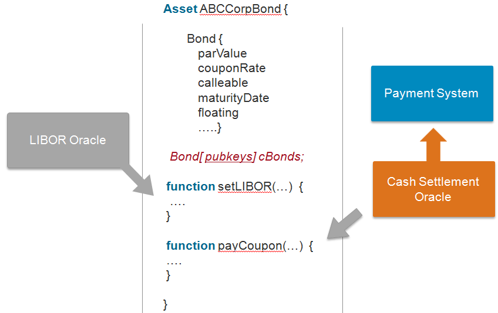

# Canonical Use Cases

### B2B Contract

Business contracts can be codified to allow two or more parties to automate contractual agreements in a trusted way.  Although information on blockchain is naturally “public”, B2B contracts may require privacy control to protect sensitive business information from being disclosed to outside parties that also have access to the ledger. 

<table>
<tr><td></td></tr>
</table>

While confidential agreements are a key business case, there are many scenarios where contracts can and should be easily discoverable by all parties on a ledger. For example, a ledger used to create offers (asks) seeking for bids. This type of contract may need to be standardized so that bidders can easily find them, effectively creating an electronic trading platform with smart contracts (aka chaincode).

<table>
<tr><td></td></tr>
</table>

#### Persona

*  Contract participant – Contract counter parties

*  Third party participant – A third party stakeholder guaranteeing the integrity of the contract.

#### Key Components

*  Multi-sig contract activation - When a contract is first deployed by one of the counter parties, it will be in the pending activation state. To active a contract, signatures from other counterparties and/or third party participants are required.

*  Multi-sig contract execution - Some contract will require one of many signatures to execute. (E.g. In trade finance, a payment instruction can only be executed if either the recipient or a authorized third party (e.g. UPS) confirms the shipment of the good)

*  Discoverability - If a contract is a business offer seeking for bids, it must be easily searchable. In addition, such contract needs to have the built-in intelligence to evaluate, select, and honor bids.

*  Payment inside contract- Integration with off-chain payment system is a must so that contract code can initiate payment transactions that are processed and settled off chain

*  Atomicity of contract execution - Atomicity of the contract is needed to guarantee asset transfers can only occur when payment is received (Delivery vs. Payment). If any step in the execution process fails, the entire transaction must be rolled back

*  Contract to chain-code communication - Contracts must be able to communicate with chaincodes deployed on the same ledger. 

*  Longer Duration contract - Timer is needed to support B2B contracts that have long execution window.

*  Reuseable contracts - Oftenly used contracts can be standardized so that they can be reused. 

*  Auditable contractual agreement -  Any contract can be made auditable to third parties. 

*  Contract life-cycle management - B2B contracts are unique and not all of them can be standardized. An efficient contract management system is needed to enchance the scalability of the ledger network

*  Validation access – only nodes with validation right are allowed to validate transactions of a B2B contract

*  View access – B2B contracts may include confidential information, so only accounts with pre-defined access right are allowed to view/interrogate them

 

### Manufacturing Supply Chain

Final assemblers, such as car manufacturers, can create a supply chain network managed by its peers and suppliers so that a final assembler can better manage its suppliers and be more responsive to events that would require vehicle recalls (possibly triggered by faulty parts supplied by some supplier). The blockchain fabric must provide a standard protocol to allow every participant on a supplychain network to input and track parts produced and used on a given vehicle.

Why is this specific example an abstract use case? Because while all blockchain cases store immutable information, and some add the need for transfer of assets between parties, this case emphasizes the need to provide deep searchability back as many as 5-10 transaction layers. It is the core of establishing provenance of any manufactured good that is made up of other goods and supplies.

<table>
<tr><td></td></tr>
</table>

#### Persona

*  Final Assembler – The business entity that performs the final assembly of a product.

*  Part supplier – Suppliers of parts. Suppliers can also be an assemblers, assembling parts they received from their own sub-suppliers and send the finished product to the final (root) assembler

#### Key Components

*  Payment upon delivery of goods - Integration with off-chain payment system is necessary so that payment instructions can be sent when parts are received.

*  Third party Audit -  All supplied parts shall be auditable by third parties. E.g. regulators may need to track the total number of parts supplied by a supplier for tax accounting purpose

*  Obfuscation of shipments - Balances shall be obfuscated so that no one supplier can deduce the business activiteis of other suppliers 

*  Obfuscation of market size - Total balance must be obfuscated so that part suppliers can’t deduce its own market share and use that as a leverage to seek for better term.

*  Validation Access – only nodes with validation right are allowed to validate transactions (shipment of parts)

*  View access – only accounts with view access right are allowed to interrogate balances of parts shipped & available.

 
### Asset Depository 

Assets such as financial securities must be able to be dematerialized on a blockchain network so that all stakeholders of an asset type will have direct access to that asset, allowing them to initiate trades and acquire information on an asset without going through layers of intermeidaries. Trades should be settled in near real time and all stakeholders must be able to access asset information in near real time. A stakeholder should be able to add business rules on any given asset type, further reducing operating cost with automation logic.

<table>
<tr><td></td></tr>
</table>

#### Persona

*  Investor – Beneficial and leagal owner of an asset

*  Issuer – Business entity that issued the asset which is now dematerialized on the ledger network

*  Custodian – Hired by investors to manage their assets, and offer other value add services on top of the assets being managed

*  Securities Depository – Depository of dematerialized assets

#### Key Components

*  Asset to cash - Integration with off-chain payment system is necessary so that issuers can make payments to and receive payments from its investors.

*  Reference Rate - Some types of assets (e.g. floating rate notes) may have attributes linked to external data (e.g. reference rate), and such information must be feed into the ledger network.

*  Asset Timer - Many types of financial assets have pre-defined life span and are required to make periodic payments to their owners, so a timer is needed to automate operation management of these assets

*  Asset Auditor -  Asset transactions must be made auditable to third parties. E.g. regulator may want to audit transactions and movements of assets to measure market risks.

*  Obfuscation of account balances - Individual account balances shall be obfuscated so that no one can deduce the exact amount an investor own.

*  Validation Access – only nodes with validation right are allowed to validate transactions updating the balances of an asset type (this could be restricted to CSD and/or issuer).

*  View access – only accounts with view access right are allowed to interrogate the chaincode that defines an asset type. If an asset represents shares of a publicly traded companies, then the view access right must be granted to every entity on the network.

# Extended Use cases

An ever expanding list of use cases

### One Trade, One Contract

From the time a trade is captured by the Front Office till the trade is finally settled, only one contract that specifies the trade will be created and used by all participants. Middle office will enrich the same electronic contract submitted by the front office, and that same contract will then be used by counterparties to confirm and affirm their trade. Finally, securities depository will settle the trade by executing the trading instructions specified on the contract. When dealing with bulk trades, the original contract can be broken down to sub-contracts that are always linked to the original parent contract.

<table>
<tr><td></td></tr>
</table>

### Direct Communication

Company A announced its intention to raise 2 Billion USD by way of right issue.  Since this is a voluntary action, company A needs to make sure the complete detail of this offer are sent to shareholders in real time regardless of how many intermediaries are involved in the process (such as receiving/paying agents, CSD, ICSD, local/global custodian banks, asset management firms, etc). Once a shareholder has made a decision, that decision will also be processed and settled (including the new issuance of shares) in real time. If a shareholder sold its rights to a third party, the securities depository must be able to record the new shares under the name of their new rightful owner.

<table>
<tr><td></td></tr>
</table>

### Separation of asset ownership and custodian’s duties

Assets should always be registered under their actual owners’ name, and third party professionals can manage and offer services over these assets without the need of taking legal the ownership of assets (through a nominee or street name). If an asset issuer needs to communicate with its listed owners (e.g. share holder list on its registrar), the issuer can do so directly with its owners. On the other hand, custodians can also buy, sell and lend assets under asset owner’s permission. Under this setup, Brokers/Custodians/CSDs can focus on providing value-add services to share owners while offloading operational duties in redirecting communication & payments from issuers to shareowners 

<table>
<tr><td></td></tr>
</table>

