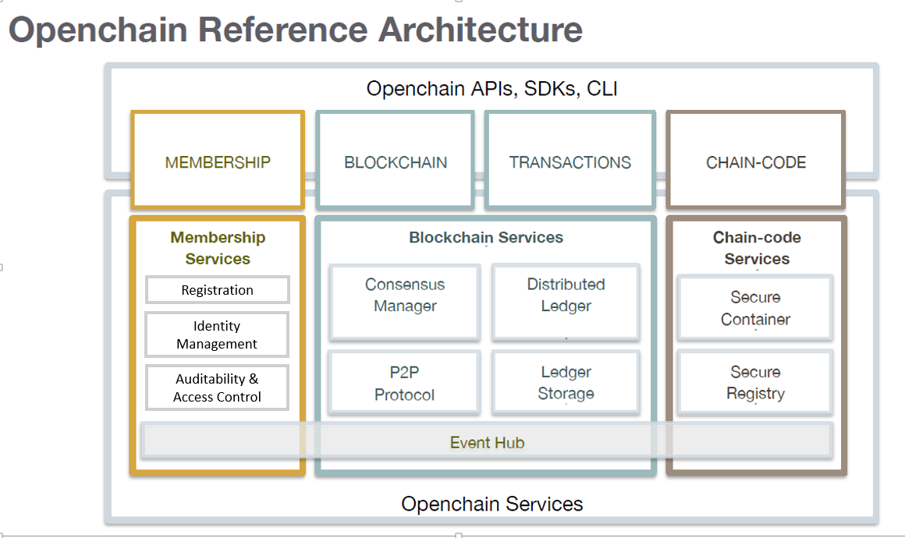
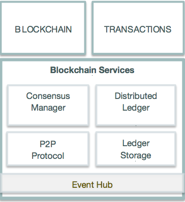
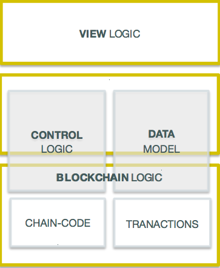

# Open Blockchain Whitepaper

## Your voice here:
If you are reading this, then it means anything said in this document or done in this open source repository is open for your input. Apply your experience, lend your voice, and show with your code how the specification and the implementation of Open Blockchain should be taken forward. Don’t like something you see here? Help us all see your point of view (in a respectful and positive way) or even better, bring some code that shows a better way.

## Abstract

This paper describes the principles, high-level architecture and initial technical direction of a blockchain suitable for industrial use cases.

The design presented here describes a blockchain fabric called Open Blockchain, a protocol for business-to-business and business-to-customer transactions. It is intended for permissioned networks (important: see definition below), and it allows compliance with regulations and respects the requirements that arise when competing businesses work together on the same network.

The central elements of this specification are smart contracts (aka chaincode), digital assets, record repository, a decentralized network and cryptographic security. To these blockchain staples, we add performance, verified identities, private and confidential transactions, and pluggable consensus model.

_For questions regarding terminologies used in OBC, check out our [glossary] (biz/glossary.md)_

## Background

Blockchain is an emerging technology pattern that can radically improve banking, supply-chain, and other transaction networks, creating new opportunities for innovation and growth while reducing the cost and risk of business operations.

With Bitcoin popularizing the domain since 2009, many businesses and industries have invested significant resources in investigating the underlying technology that powers the popular, yet controversial, cryptocurrency.

Blockchain first gained traction in the financial industry because this technology has showed that assets can be issued, traded, managed, and serviced on an immutable shared ledger system that is the single point of truth. As opposed to the world of SoR (System of Records), where every member in the ecosystem needs to maintain its own ledger system, and reconsolidate transaction updates with one another in the usually inefficient, expensive, and often not standardized inter-organizational operation flows. 

As the shared ledger concept is gaining tracking in the business world, blockchain’s other aspect – smart contract – is also getting a lot of attention from many industries. Smart contract are business rules deployed on blockchain that are shared and validated collectively by a group of business stakeholders. It can be very useful in automating business processes in a trusted way by involving all stakeholder to process and validate contractual rules collectively. 

Entering 2016, Blockchain awareness has now reached the point that the demand for a solution suitable for industry is surging.

#### Why a new fabric:
Blockchain technology is in its infancy and is often not well suited for the needs of industry. Scalability challenges and the lack of support for confidential and private transactions, among other issues, make its use infeasible for many important industry applications. We lay out an industry–focused design, based on and extending the learnings of the pioneers in this field.

## Industry Use Cases

We have compiled a set of initial blockchain requirements that are considered essential for supporting the following abstract use cases.

(Note: use cases here help guide architecture and test-driven development. While still a work in progress, the use cases should be something all contributors agree on...both in the content and stack-ranked prioritization of them. Propose changes if you feel these miss the mark. It is best if there are no more than 4 abstract use cases, and three is preferred.)

#### Business Contracts

Business contracts can be codified to allow two or more parties to automate contractual agreements in a trusted way.  Although information on blockchain is naturally “public”, B2B contracts may require privacy control to protect sensitive business information from being disclosed to outside parties that also have access to the ledger.

While confidential agreements are a key business case, there are many scenarios where contracts can and should be easily discoverable by all parties on a ledger. For example, a ledger used to create offers (asks) seeking bids. This type of contract may need to be standardized so that bidders can easily find them.

#### Asset Depository

Assets such as financial securities must be able to be dematerialized on a blockchain network so that all stakeholders of an asset type will have direct access to that asset, allowing them to initiate trades and acquire information on an asset without going through layers of intermediaries. Trades should be settled in near real time, and all stakeholders must be able to access asset information in near real time. A stakeholder should be able to add business rules on any given asset type, further reducing operating cost with automation logic. The creator of the asset must be able to make the asset and any rules associated with the trading of that asset private and confidential or public as the use case warrants.

#### Supply Chain

The blockchain fabric must provide a means to allow every participant on a supplychain network to input and track sourcing of raw materials, record parts manufacturing telemetry, track provenance of goods through shipping, and maintain immutable records of all aspects of the production and storage of a finished good through to sale and afterwards. In addition to employing both Business Contracts and Asset Depository patterns above, this case emphasizes the need to provide deep searchability back many transaction layers. It is the core of establishing provenance of any manufactured good that is made up of other goods and supplies.

_For more details about these use cases and their requirements, click [here] (biz/usecases.md)_

## Definitions

#### InterLedger
Open Blockchain is based on the expectation that there will be many blockchain networks, with each network ledger serving different purposes. While there may be a popular single instance of a general-use network, there is no requirement for any ledger to rely upon any other network for core functionality. However, there must be an addressing system to allow transactions on one ledger to discover and utilize appropriate transactions and smart contracts (chaincode) on other ledgers.

#### Permissioned Network
We describe permissioned networks as ones where validating and non-validating nodes are run by known whitelisted organizations and where transactors on the network receive identity from an issuing authority service on the network. Depending on the purpose of the network, the issuing authority can make it very easy to get an identity and transact (similar to getting a Gmail account) or very restrictive. A network can run very publicly, making it easy to integrate into a mobile app project. Or it can be completely private and known only to parties that have been invited and whose identity has been validated. Because the fabric is designed to support many networks for many different purposes, and to allow addressing between them, the protocol must allow for these different kinds of uses and different levels of permissioning. But the protocol is not designed to allow the creation of a network of anonymous validators or miners operating outside regulatory oversight.

#### Logic = Chaincode = Smart Contracts
Blockchain logic, often referred to as “smart contracts,” are self-executing agreements between parties that have all relevant covenants spelled out in code, settle automatically, and can be dependent upon future signatures or trigger events. In the Open Blockchain project, we call this “chaincode” to help hold clarity between blockchain logic and the human-written contracts that they can sometimes represent. (This term is still under review and may change.)  

The chaincode concept is more general than the smart contract concept defined by Nick Szabo [2]. Chaincode can be written in any mainstream programming language and executed in Docker containers inside the Open Blockchain context layer. Chaincode provides the capability to define smart contract templating language (similar to Velocity or Jade) and to restrict the functionality of the execution environment and the degree of computing flexibility to satisfy the legal contractual requirements.

####Private Transactions
The identity and pattern of behavior of any party on a network must be impossible for unauthorized parties to ascertain by inspecting the ledger.

####Confidentiality
In addition to privacy, the chaincode and other parameters of a transaction must be able to be set to confidential, rendering it inaccessible to anyone other than the stakeholders to that contract or transaction. This is done with a form of consensus wherein chaincode can stipulate the parties and validators allowed to see (decrypt), sign, and execute the chaincode of the contract and other attributes of the transaction. For example, a startup that creates 10 million shares of private stock for its ten shareholders can commit that to the ledger and stipulate that all (or some) of those ten shareholders must sign off on any changes to the number of shares, additions/subtractions to the shareholder group, or transfers of shares between them. Only the shareholders and their respective validators execute the chaincode for this agreement, so no other parties on the network can read the code and discover the number of shares or the nature of the startup's shareholder arrangement. The reason this is still done on the blockchain under this method is that the chaincode and associated transactions, once executed and committed to the ledger, are immutable, because they are hashed and replicated to the entire network. Only the 10 shareholders know what the transactions are, and only they can perform any operations on the contract, but the integrity of the agreement, the output of the operations, and the record of transactions is maintained by all.  

## Featured Requirements

#### Private Transactions and Confidential Contracts
Currently, transaction patterns are too easy to be observed and interpreted. Shared ledgers may give away details about a supplier relationship that should not be revealed to their competitors. In tight supplier/buyer communities, even one party's relative volume of trade is something which would not be appropriate for a system supporting trade between parties to reveal. Therefore, a business ready blockchain must provide mechanisms to conceal identity, transaction patterns, and terms of confidential contracts from being publically identified by unauthorized third parties.
Content confidentiality is achieved by encrypting the transactions such that only the stakeholders can decrypt and execute them. In addition, a piece of business logic (chaincode, aka smart-contract) can also be cryptographically secured (if its confidentiality is required by its stakeholders) and will only get loaded and decrypted at runtime. (see architecture below for details)

#### Identity and Auditability
While private transactions are important, business usage of blockchain also needs to comply with regulations and make it easy for regulators to investigate transaction records. Also, a party must be able to prove its identity and ownership of an asset after the fact, perhaps years after the fact, without the mechanism for establishing that identity being able to be used by bad actors to appropriate a party's identity or ascertain their activities on the ledger.
The protocol starts with a cryptographic certificate encapsulating a user’s confidential data registered on a Registration Authority. The Registration Authority can issue and revoke identities participating in a network. From this identity, the protocol can generate security keys for members to transact on a network, and these keys will conceal the identities of the transacting parties, providing privacy support to the network.

#### Finality
Data stores for industrial use must provide finality, meaning simply that there must be certainty at what point a transaction is committed, and that after this point, it will not change on its own. Many current blockchain networks offer only eventual consistency, rather than a firm promise of finality, and can suffer arbitrary loss of committed information as they are designed to allow for, and cope with, forks in their global state.

#### Performance and Scalability
If blockchain becomes the fabric of an economically aware Internet, then it must be designed for performance over the long haul. A ledger or set of ledgers must be able to operate continuously for 100+ years and still allow discoverability, search, identity resolution and other key functions in user-acceptable timeframes. Likewise, the number of nodes and transactors on a given network may become extremely large over time. The fabric must be able to handle such expansion without performance degradation.

#### Modular Consensus

Different networks may need to deploy different consensus algorithms to fit their usage scenarios. Consensus algorithms on the protocol must be pluggable, allowing users to select the consensus algorithm of their choice during deployment. The protocol will provide a Practical Byzantine Fault Tolerance (PBFT) [1] implementation in its initial release, and we expect the community to contribute more consensus algorithm modules later.

## Architecture
Figure 1 below shows the reference architecture aligned in 3 categories: Membership, Blockchain, and Chaincode. These categories are a logical structure, not a physical depiction of partitioning of components into separate processes, address spaces or (virtual) machines.

Some of these components will be built from the ground up; some will use existing open source code as appropriate, and some will just interface with existing services to fulfill the required functions.

Figure 1:  Open Blockchain Reference architecture

The Membership category provides services for managing identity, privacy, and confidentiality on the network. Participants register to get identities, which will enable the Attribute Authority to issue security keys to transact. Reputation Manager enables auditors to see transactions pertaining to a participant. Of course, auditors will have to be granted proper access authority by the participants.

Blockchain services manage the distributed ledger through a peer-to-peer protocol, built on HTTP/2. The data structures are highly optimized to provide the most efficient hash algorithm for maintaining the world state replication. Different consensus (PBFT, Raft, PoW, PoS) may be plugged in and configured per deployment.

Chaincode services are a secured and lightweight way to sandbox the chaincode execution on the validators. The environment is a “locked down” and secured container along with a set of signed base images containing secure OS and chaincode language, runtime and SDK images for Golang, Java, and Node.js. Other languages can be enabled if required.

#### MEMBERSHIP

<table border="0">
<col>
<col>
<tr>
<td width="30%"></td>
<td valign="top">
Open Blockchain is a private-validator network protocol, so all entities are required to register with membership services to get identity to access and to transact on the network. Validators at network setup can determine the level of permission required to transact. It is possible for a network to be very liberally permissive, allowing ease of access supporting rapid and high adoption goals, and it is possible for a network to be very restricted. This is configured in network setup.

Registration Authority issues enrollment certificate necessary to establish identity for a member. Once registered, the member has the required credentials to participate in the network, no need for proof-of-work or proof-of-stake at this point. 

Attributes Authority issues security keys to members to transact and to ensure the privacy of the members on the network. Non-stakeholders can't link the transactions back to the members. Transactions appear to be coming from random addresses, completely shuffled by the system. 

Reputation Manager allows authorized auditors to link security keys to identity, and consequently, prove the relationship between transactions and members.
</td>
</tr>
</table>

#### BLOCKCHAIN

<table border="0">
<col>
<col>
<tr>
<td width="50%"></td>
<td valign="top">
Blockchain services consists of 3 key components: Distributed Ledger, Consensus Manager, and Peer-to-Peer (P2P) Protocol. 

P2P Protocol uses <a href="http://www.grpc.io/docs">Google RPC</a>, which is implemented over HTTP/2 standards, providing many capabilities including bidirectional streaming, flow control, multiplexing requests over a single connection. And most important of all, it works with existing Internet infrastructure – firewalls, proxies, and security. This component defines messages used by peer nodes, from point-to-point to multicast. 

The Distributed  Ledger component manages the blockchain and the world state with 3 key attributes:
<ul>
  <li>Efficiently calculating a cryptographic hash of the entire dataset after each block</li>
  <li>Efficiently transmitting a minimal "delta" of changes to the dataset, when a peer is out of sync and needs to "catch up”</li>
  <li>Minimizing the amount of data kept around necessary for each peer to operate</li>
</ul>
</td>
</tr>
</table>

The Ledger uses <a href="http://rocksdb.org"> RocksDB</a> to persist the dataset and builds an internal data structure to represent the state that satisfies the above 3 criteria. Large documents or files are not stored on the Ledger but off-chain storage. Their hashes may be stored on-chain as part of the transactions. This is necessary to maintain the integrity of the documents or files.

There are 2 types of transactions: code-deploying transactions and code-invoking transactions. A code-deploying transaction may submit, update, or terminate a piece of chaincode, and it is the validators’ responsibility to protect the authenticity and integrity of the code and its execution environment. On the other hand, a code-invoking transaction is an API call to a chaincode function. This process is similar to how URI invokes a servlet in JEE. Note that each chaincode maintains its own state, and a function call is a common way to trigger chaincode state changes.

Consensus Manager is an abstraction defining the interface between the consensus algorithm and the other components. Consensus receives transactions, and depending on the algorithm, decides how to organize the transactions and when to execute them. Successful execution of transactions results in changes to the ledger.

Open Blockchain provides an implementation of Byzantine Agreement with advanced features in fault tolerance and scalability.

Event Hub in a decentralized network is complex in nature, as an event may appear to occur multiple times, each on a peer node. Callbacks can end up receiving multiple invocations for the same event. Therefore, a peer node (preferably non-validator and local) manages the event pub/sub that applications are interacting with. The peer node emits events as conditions satisfied in no particular order. Events are not persisted — fire-and-forget, so applications should capture events if required.

#### CHAINCODE
<table border="0">
<col>
<col>
<tr>
<td width="30%"></td>
<td valign="top">
As defined in the previous sections, chaincode is a decentralized transactional program, running on the validators. 

Chaincode Services use <a href="https://github.com/docker/"> Docker </a> to host the chaincode without relying on any particular virtual machine or computer language. Docker provides a secured, lightweight way to sandbox the chaincode execution. The environment is a “locked down” and secured container along with a set of of signed base images containing secure OS and chaincode language, runtime and SDK images for Golang, Java, and Node.js. Other languages can be enabled if required. 

Secure Registry service enables Secured Docker Registry of base Open Blockchain images and custom images containing chaincodes.

The world state represents the state for every chaincode. Each chaincode is assigned its own state that can be used to store data in a key-value format, where keys and values are arbitrary byte arrays. The world state also contains the block number to which it corresponds.

</td>
</tr>
</table>

Chaincode transactions are time bounded and configured during chaincode deployment. This is similar to a database call or a Web service invocation. If a transaction times out, it is considered an error and will not cause state changes on the ledger. One chaincode function may call another chaincode function if the callee has the same restrictive confidentiality scope; that is, a confidential chaincode may call another confidential chaincode if they share the same group of validators.

As transactions are run in a new block, a delta from the world state in the last block on the blockchain is maintained. If consensus is reached for the current block, the changes are committed to the database, and the world state block number is incremented by 1. If peers do not reach consensus, the delta is discarded and the database is not modified.

To meet the confidentiality requirement required by some business agreements written in chaincode, appropriate validators must be assigned before deployment. This will create quorums of validators during execution of transaction blocks. Validation nodes not selected to validate a confidential chaincode can just request for the state updates from those who are. At the end of each successful block execution consensus, the world state must be consistent on all validating nodes.

## Application Programming Interface
Open Blockchain includes REST and JSON RPC APIs, events, and an SDK for applications to communicate with the network. Typically applications interact with a peer node, which will require some form of authentication to ensure the entity has proper privilege, so messages from a client are signed by the client identity and verified by the peer node.

 

At the top, CLI is the command line interface to the network. Open Blockchain provides a set of CLIs to administer and manage the network. CLI can also be used during development to test chaincodes. ReST API and SDK are built on top of JSON-RPC API, which is the most complete API layer. SDK will be available in Golang, JavaScript, and Java. Other languages can be added as necessary.

The API spans the following categories:

*  Identity - Enrollment to get certificates or revoking a certificate
*  Address - Target and source of a transaction
*  Transaction - Unit of execution on the ledger
*  Chaincode - Program running on the ledger
*  Blockchain - Content of the ledger
*  Network - Information about the blockchain network
*  Storage - External store for files or documents
*  Event - Sub/pub events on blockchain

## Application Model
<table>
<col>
<col>
<tr>
<td width="50%"></td>
<td valign="top">
An Open Blockchain application follows a MVC-B architecture – Model, View, Control, BlockChain.

<ul>
  <li>VIEW LOGIC – Mobile or Web UI interacting with control logic.</li>
  <li>CONTROL LOGIC – Coordinates between UI, Data Model and Open Blockchain APIs to drive transitions and chain-code.</li>
  <li>DATA MODEL – Application Data Model – manages off-chain data, including Documents and large files.</li>
  <li>BLOCKCHAIN  LOGIC – Blockchain logic are extensions of the Controller Logic and Data Model, into the Blockchain realm.    Controller logic is enhanced by chaincode, and the data model is enhanced with transactions on the blockchain.</li>
</ul>

For example, a Bluemix PaaS application using Node.js might have a Web front-end user interface or a native mobile app with backend model on Cloudant data service. The control logic may interact with 1 or more chaincodes to process transactions on the blockchain.

</td>
</tr>
</table>

## Network Topology
There are 3 potential deployment models: Cloud hosted 1 network, cloud hosted multiple networks, or within each participant’s intranet.

The simplest and most efficient topology is cloud hosted 1 network, where each participant owns a number of peer nodes, including validators. Even though the network is in cloud, hosted by a vendor, who owns the physical boxes, the participants contractually control the computing resources, making it decentralized within a centralized environment.

Cloud hosted multiple networks allow participants to have their peer nodes hosted by any cloud providers, given that peer nodes can connect to one another over HTTPs.

Similar to cloud hosted multiple networks, using participants’ own networks is also possible via HTTPs channel.

## References
- [1] Miguel Castro and Barbara Liskov; [Practical Byzantine Fault Tolerance] (http://dl.acm.org/citation.cfm?id=296824)
- [2] [Wikipedia Smart Contract](https://en.wikipedia.org/wiki/Smart_contract)
- [3] Satoshi Nakamoto, [Bitcoin: A Peer-to-Peer Electronic Cash System](https://bitcoin.org/bitcoin.pdf)
- [4] [Ethereum Whitepaper] (https://github.com/ethereum/wiki/wiki/White-Paper)
